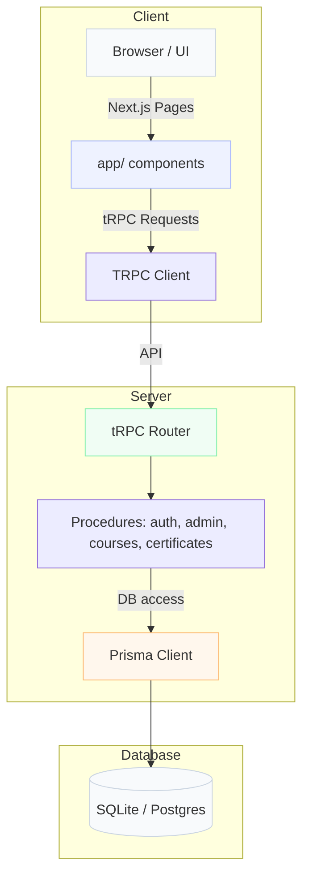

# TeachNLearn 📚🚀

Modern learning platform built with **Next.js**, **tRPC**, **Prisma**, **Radix UI**, and **Tailwind CSS**.

<p align="center">
  <picture style="width: 500px">
    
  </picture>
</p>

## ✨ Highlights

- ✅ Course management for admins
- ✅ Learning interface with lessons, modules, and tests
- ✅ Authentication flows with signup/signin
- ✅ Dashboard and course enrollment UI
- ✅ Certificate generation and progress tracking
- ✅ Built with modern React, TypeScript, and server-driven API patterns

## 🧩 Core Tech

- **Next.js 16**
- **React 19**
- **TypeScript**
- **Prisma**
- **tRPC**
- **Radix UI + lucide-react**
- **Tailwind CSS**
- **SQLite / PostgreSQL** support via Prisma adapters

## 🏗️ Architecture Overview



## 📁 Project Structure

- `app/` — Next.js app routes and layouts
- `components/` — UI components, admin panels, auth forms, dashboards
- `lib/` — auth helpers, db utilities, tRPC provider
- `server/` — tRPC router registration and context
- `prisma/` — Prisma schema
- `public/` — static assets
- `scripts/` — SQL seed and initialization helpers

## ⚡ Getting Started

1. Install dependencies:

```bash
npm install
```

2. Generate Prisma client:

```bash
npm run db:generate
```

3. Initialize or migrate the database:

```bash
npm run db:migrate
```

4. Start development server:

```bash
npm run dev
```

5. Open `http://localhost:5231`

## 🛠️ Useful Scripts

- `npm run dev` — start local dev server
- `npm run build` — build production app
- `npm run start` — start production server
- `npm run lint` — run next lint
- `npm run db:studio` — open Prisma Studio
- `npm run db:push` — push schema to database

## 💡 Notes

- Uses `next dev --port 5231 --turbopack`
- Auth and UI are split between `app/auth` and `components/auth`
- Admin functionality is located under `components/admin` and `app/(authenticated)/admin`

---

Built for modern learning experiences with clean UI and strong API integration.
