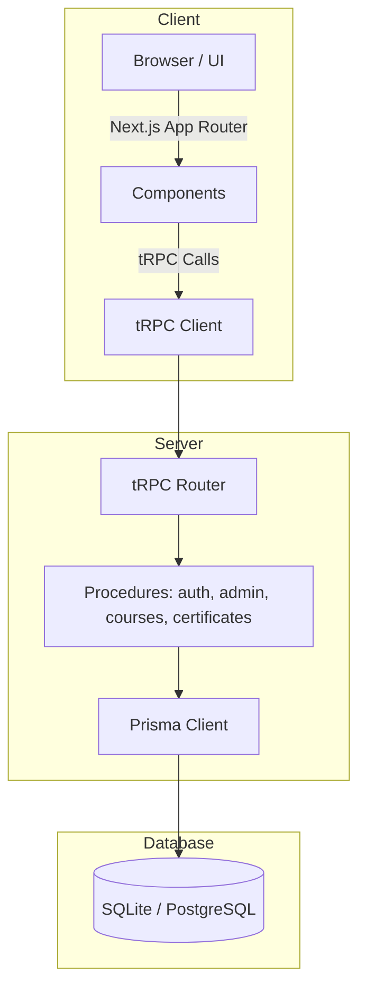

<div align="center">

# TeachNLearn

**A modern, robust learning platform for seamless course management and student engagement.**

<p align="center">
  <a href="https://nextjs.org"></a>
<a href="https://react.dev">
  
</a>
  <a href="https://typescriptlang.org"></a>
  <a href="https://prisma.io"></a>
  <a href="https://trpc.io"></a>
  <a href="https://tailwindcss.com"></a>
<a href="https://nextjs.org"></a>
  </a>
</p>


</div>

---

## ✨ Features

- **Admin Control** – Manage courses, modules, and users

- **Interactive Learning** – Structured lessons, modules, and assessments
- **Authentication System** – Secure sign-up and login flows
- **Student Dashboard** – Track progress and enrolled courses
- **Certificates & Milestones** – Automated progress tracking and achievements
- **Type-Safe Backend** – End-to-end type safety with tRPC + Prisma + TypeScript

---

## 🏗️ Architecture

The platform uses a **type-safe, full-stack architecture** connecting UI → API → Database seamlessly.



---

## ⚡ Getting Started

### 📦 Prerequisites

- Node.js (recommended: latest LTS)
- SQLite or PostgreSQL database

---

### 🔧 Installation

1. **Clone & install dependencies**

```bash
npm install
```

2. **Setup environment variables**

```bash
cp .env.example .env
```

3. **Generate Prisma client**

```bash
npm run db:generate
```

4. **Run database migrations**

```bash
npm run db:migrate
```

5. **Start development server**

```bash
npm run dev
```

App will be running at:
👉 [http://localhost:5231](http://localhost:5231)

---

## 📁 Project Structure

```plaintext
📂 app/             # Next.js App Router routes and layouts
 ┣ 📂 auth/         # Authentication routes
 ┣ 📂 (auth)/admin/ # Admin-specific protected routes
📂 components/      # Reusable UI, admin panels, and auth forms
📂 lib/             # Utility functions, tRPC provider, auth/db helpers
📂 server/          # tRPC router registration and context
📂 prisma/          # Database schema and migrations
📂 public/          # Static assets and images
📂 scripts/         # SQL seed data and initialization helpers
```

---

## 🛠️ Scripts

| Command              | Description                  |
| -------------------- | ---------------------------- |
| `npm run dev`        | Start dev server (Turbopack) |
| `npm run build`      | Build for production         |
| `npm run start`      | Start production server      |
| `npm run lint`       | Run ESLint                   |
| `npm run db:studio`  | Open Prisma Studio           |
| `npm run db:push`    | Push schema (no migrations)  |
| `npm run db:migrate` | Run migrations               |
